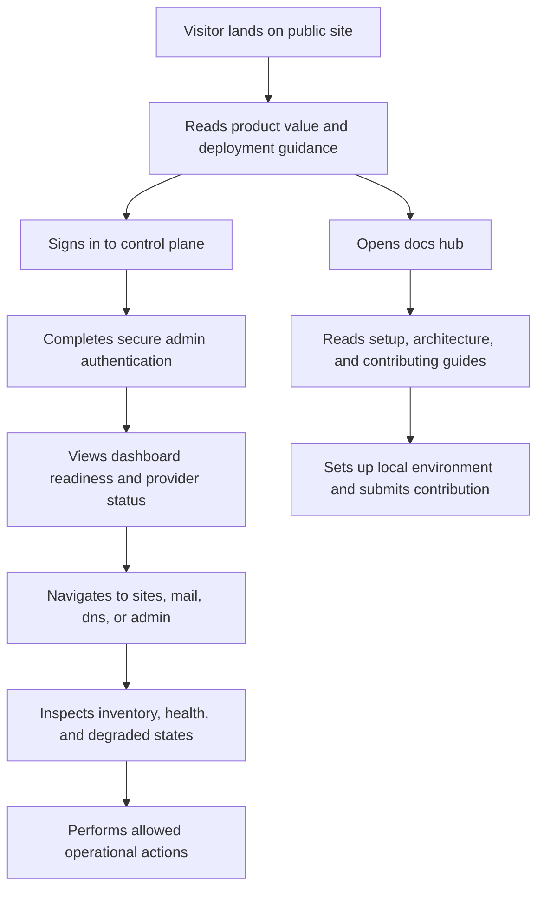

## 1. Product Overview
Tetra Host Open Source is a Vercel-grade control plane for infrastructure visibility and operations, rebuilt as an open-source web application with a Python core and a Vercel-native frontend experience.
- It helps operators, contributors, and self-hosters manage sites, DNS, mail, and platform health through a reliable, accessible, well-documented interface.
- Its market value is a production-ready open-source control plane that feels as polished as a best-in-class Vercel product while remaining extensible for self-hosted infrastructure teams.

## 2. Core Features

### 2.1 User Roles
| Role | Registration Method | Core Permissions |
|------|---------------------|------------------|
| Visitor | Public access | Browse product site, documentation, roadmap, and open-source information |
| Admin Operator | Bootstrap admin or invited admin | Sign in, review platform status, inspect provider inventory, trigger allowed operational actions |
| Contributor | GitHub-based contribution flow | Read contributing guides, architecture docs, setup instructions, issue and PR workflows |

### 2.2 Feature Module
1. **Marketing home**: product narrative, quality pillars, architecture highlights, deployment guidance, CTA into docs and demo areas
2. **Documentation hub**: getting started, architecture, deployment, configuration, API contracts, contribution workflow, code of conduct
3. **Operational dashboard**: platform health, environment readiness, provider connectivity, inventory summaries, degraded-state guidance
4. **Sites console**: application inventory, deployment status, health signals, search and filter interactions, safe action affordances
5. **Mail console**: domain and mailbox visibility, readiness messaging, empty states, operational summaries
6. **DNS console**: zone and record visibility, refresh behavior, configuration guidance, degraded-state handling
7. **Admin console**: admin inventory, provider readiness, security posture summary, operational controls
8. **Authentication flow**: secure admin login, logout, session UX, protected route handling, accessible validation feedback

### 2.3 Page Details
| Page Name | Module Name | Feature description |
|-----------|-------------|---------------------|
| Home | Hero narrative | Explain the product, highlight Vercel-grade quality standards, and route users to docs or the live control plane |
| Home | Open-source trust section | Show contribution model, code quality commitments, release practices, and accessibility standards |
| Home | Architecture preview | Explain the Python core plus Vercel frontend model with deployment-ready messaging |
| Docs | Getting started | Installation, local setup, environment variables, demo path, and deployment quickstart |
| Docs | Production handbook | Security controls, Vercel deployment path, Python API runtime notes, observability, rollback guidance |
| Docs | Contributor guide | Branching, lint/test workflow, coding standards, issue templates, release expectations |
| Login | Auth form | Accessible labels, validation, error handling, focus management, and safe post-login redirects |
| Dashboard | Platform overview | Surface environment status, provider status, request health, metrics summaries, and action shortcuts |
| Dashboard | Degraded-state guidance | Explain exactly what is missing when a provider is not configured or unavailable |
| Sites | Inventory table | Search, filter, status badges, domains, health checks, and safe deploy actions |
| Sites | Reliability guidance | Expose unhealthy states clearly and describe next corrective action for operators |
| Mail | Domain visibility | Show mail domains, quota summaries, mailbox counts, and configuration instructions when unavailable |
| DNS | Zone visibility | Show zones and records with selection flow, refresh handling, and helpful empty states |
| Admin | Readiness and governance | Show admin accounts, provider readiness, environment posture, and operator-only controls |

## 3. Core Process
Visitors land on the public product site, review docs and open-source governance, then either self-host the platform or sign in as an admin. Admin operators authenticate through a secure flow, view platform readiness, inspect provider-backed resources, and act on safe operational controls. Contributors use the documentation hub to understand architecture, setup, testing, and contribution expectations before opening issues or pull requests.

## 4. User Interface Design
### 4.1 Design Style
- Primary colors: near-black graphite, warm off-white, muted cobalt, and precise emerald/amber/red status accents
- Button style: rounded but disciplined, high-contrast, subtle elevation, strong focus rings
- Font and sizes: distinctive editorial display font paired with a highly legible technical sans-serif body font; large typography for hero and compact data-dense controls in admin views
- Layout style: desktop-first split between narrative marketing surfaces and dense operator consoles; layered cards, strong grid alignment, restrained motion
- Icon style suggestions: thin-line technical icons, purposeful status indicators, no playful emoji in product UI

### 4.2 Page Design Overview
| Page Name | Module Name | UI Elements |
|-----------|-------------|-------------|
| Home | Hero narrative | Large editorial typography, architecture callouts, layered gradients, measured motion, dual CTAs |
| Home | Open-source trust section | Governance cards, release workflow, contribution steps, community guidelines |
| Docs | Content layout | Sticky sidebar, search, section anchors, code blocks, callouts, keyboard-friendly navigation |
| Login | Auth form | Centered card, labeled fields, visible errors, password manager support, strong focus treatment |
| Dashboard | Provider summary | Status cards, service badges, sparkline-style metric surfaces, action rail |
| Sites | Inventory table | Dense responsive data table, filter chips, health badges, deploy buttons, empty and degraded states |
| Mail | Visibility panel | Summary cards, tables, guidance banners when credentials are missing |
| DNS | Zone explorer | Selector, records table, provider state banner, error callout patterns |
| Admin | Governance panel | Admin list, readiness matrix, environment posture cards, operational metadata |

### 4.3 Responsiveness
The experience is desktop-first, with tablet and mobile adaptations for navigation, tables, and documentation reading. Touch targets remain accessible, dense tables collapse into stacked cards on narrow screens, and keyboard navigation plus visible focus states are mandatory across all interactive components.
