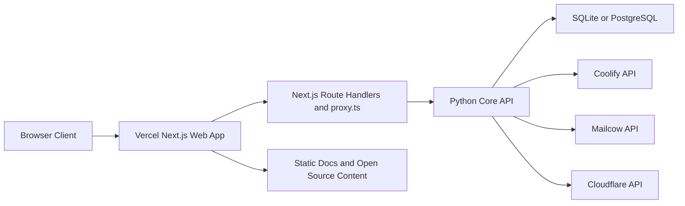
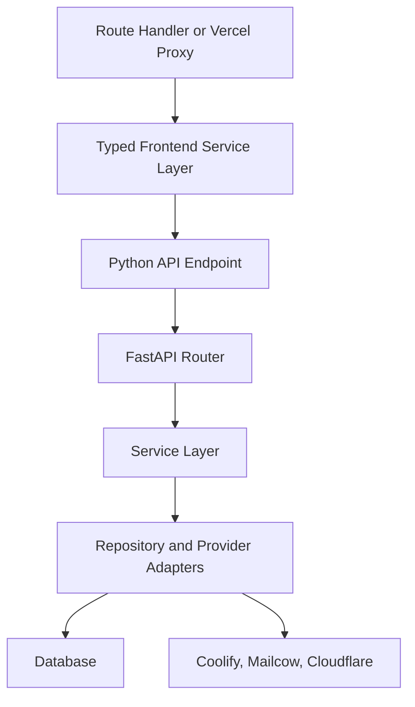
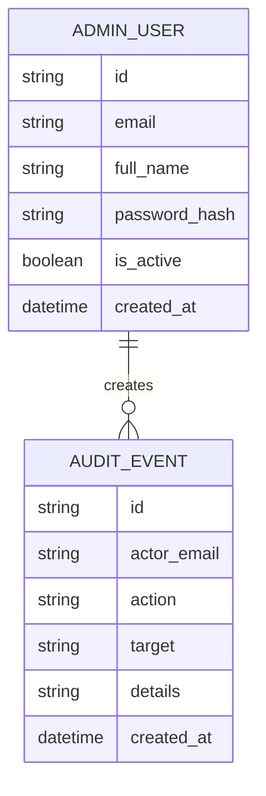

## 1. Architecture Design


## 2. Technology Description
- Frontend: Next.js 16 App Router + React 19 + TypeScript 5 + Tailwind CSS 4
- UI primitives: accessible headless components with strict keyboard support and typed design tokens
- State and data: Server Components by default, client components only for interaction, typed fetch wrappers, optimistic-free safe mutations
- Validation: Zod for frontend forms and API contracts
- Testing: Vitest, React Testing Library, Playwright, ESLint, TypeScript strict mode
- Documentation: MDX-powered docs hub and repository-root open-source governance files
- Backend core: Python 3.11+ FastAPI services extracted into API-focused modules
- Backend deployment mode: Vercel-compatible Python endpoints for lightweight control-plane APIs, with the same Python core remaining portable for self-hosted runtime growth
- Initialization tool: `create-next-app` for the frontend workspace and a dedicated Python API package boundary for the control-plane core

## 3. Route Definitions
| Route | Purpose |
|-------|---------|
| / | Public home page for the open-source control plane |
| /docs | Documentation hub landing page |
| /docs/getting-started | Local setup and first-run guide |
| /docs/architecture | System architecture and integration model |
| /docs/deployment | Vercel deployment and environment contract |
| /docs/contributing | Contribution workflow, quality gates, and review expectations |
| /auth/login | Secure admin sign-in page |
| /dashboard | Platform overview and readiness summary |
| /sites | Sites inventory and operational controls |
| /mail | Mail visibility console |
| /dns | DNS visibility console |
| /admin | Admin governance and readiness page |
| /api/health | Frontend health endpoint for deployment checks |
| /api/proxy/* | Vercel-side typed BFF layer for browser-safe communication with the Python core |

## 4. API Definitions
```ts
export type ProviderStatus = 'connected' | 'degraded' | 'not_configured'

export interface HealthResponse {
  ok: boolean
  app: string
  env: 'development' | 'staging' | 'production'
  version: string
  requestId: string
}

export interface ReadinessResponse {
  ok: boolean
  providers: {
    coolify: boolean
    mailcow: boolean
    cloudflare: boolean
  }
  auth: {
    session: boolean
    csrf: boolean
  }
}

export interface DashboardSummary {
  providers: Array<{
    name: 'Coolify' | 'Mailcow' | 'Cloudflare'
    status: ProviderStatus
    detail: string
  }>
  metrics: {
    sites: number
    unhealthySites: number
    mailDomains: number
    dnsZones: number
    admins: number
  }
}

export interface SiteRecord {
  id: string
  name: string
  status: string
  primaryDomain: string
  repository: string
  environment: string
  updatedAt: string
  healthcheckEnabled: boolean
}

export interface MailDomainRecord {
  domainName: string
  mailboxes: number
  aliases: number
  quotaBytes: number
  active: boolean
}

export interface DNSZoneRecord {
  id: string
  name: string
  status: string
  paused: boolean
}
```

## 5. Server Architecture Diagram


## 6. Data Model
### 6.1 Data Model Definition


### 6.2 Data Definition Language
```sql
CREATE TABLE admin_users (
  id VARCHAR(36) PRIMARY KEY,
  email VARCHAR(255) NOT NULL UNIQUE,
  full_name VARCHAR(255) NOT NULL,
  password_hash VARCHAR(255) NOT NULL,
  is_active BOOLEAN NOT NULL DEFAULT TRUE,
  created_at TIMESTAMP NOT NULL DEFAULT CURRENT_TIMESTAMP
);

CREATE INDEX idx_admin_users_email ON admin_users(email);

CREATE TABLE audit_events (
  id VARCHAR(36) PRIMARY KEY,
  actor_email VARCHAR(255) NOT NULL,
  action VARCHAR(255) NOT NULL,
  target VARCHAR(255) NOT NULL,
  details TEXT NOT NULL,
  created_at TIMESTAMP NOT NULL DEFAULT CURRENT_TIMESTAMP
);

CREATE INDEX idx_audit_events_actor_email ON audit_events(actor_email);
CREATE INDEX idx_audit_events_created_at ON audit_events(created_at);
```

## 7. Implementation Decisions
- Keep the Python domain logic and provider integrations as the source of truth for operational behavior.
- Build a new `apps/web` workspace for the Vercel-facing frontend, documentation hub, OSS governance pages, and typed BFF routes.
- Expose browser-safe access through Next.js Route Handlers and `proxy.ts`, following current Next.js guidance that treats the frontend API layer as a backend-for-frontend rather than a full backend replacement.
- Use strict TypeScript, schema validation, a shared error envelope, and explicit loading or error boundaries on every operator-facing route.
- Prefer Server Components for read-heavy pages and isolate client interactivity to search, filtering, and minor form interactions.
- Enforce accessibility and quality via linting, type-checking, unit tests, integration tests, and end-to-end smoke coverage before deployment.
- Include open-source repository standards: `CONTRIBUTING.md`, `CODE_OF_CONDUCT.md`, issue templates, pull request template, architecture docs, and deployment guides.

## 8. Verification Strategy
- Frontend checks: `pnpm lint`, `pnpm typecheck`, `pnpm test`, `pnpm test:e2e`
- Backend checks: Python linting, tests, and contract verification for adapted API endpoints
- Accessibility checks: keyboard navigation, semantic labels, visible focus, contrast validation, and automated a11y assertions in end-to-end tests
- Deployment checks: `vercel build`, preview deployment validation, production health endpoint checks, and environment-variable contract validation
